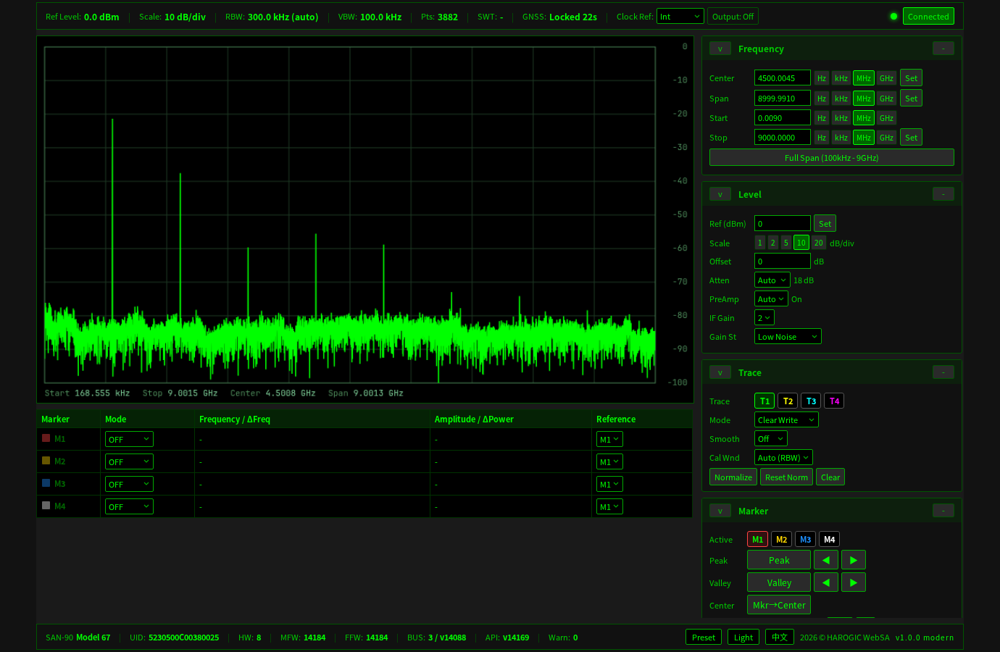
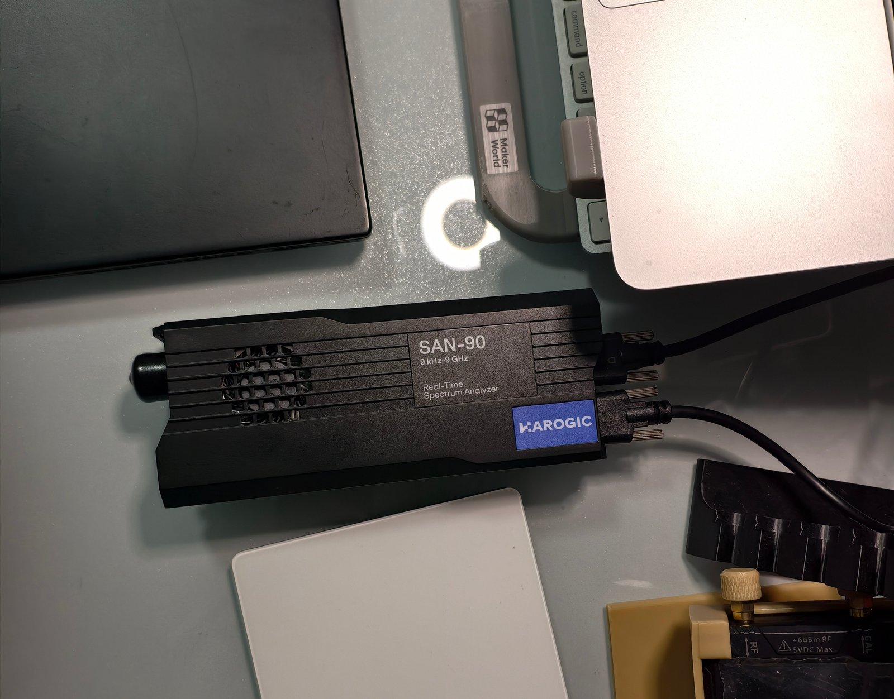
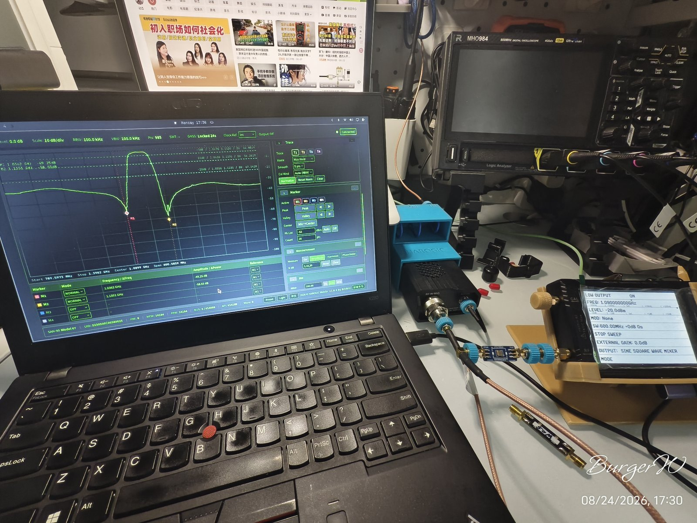
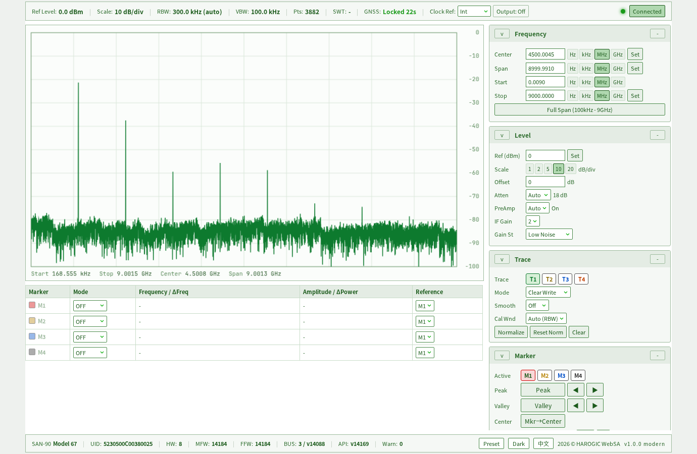
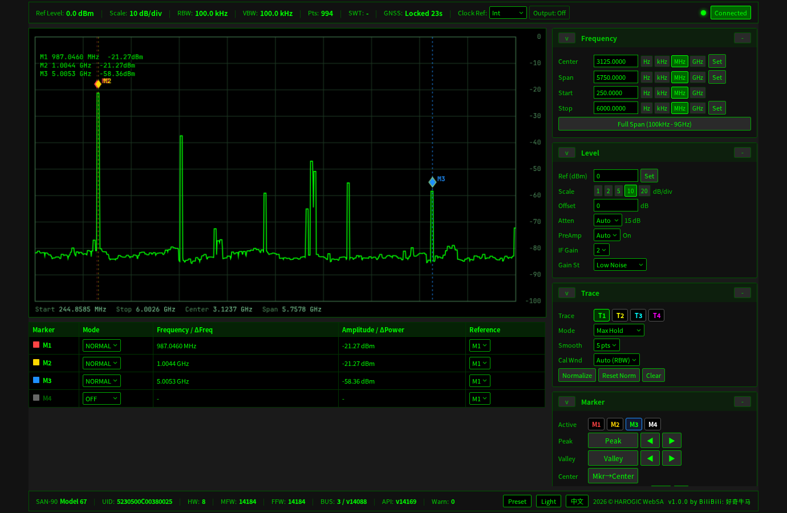
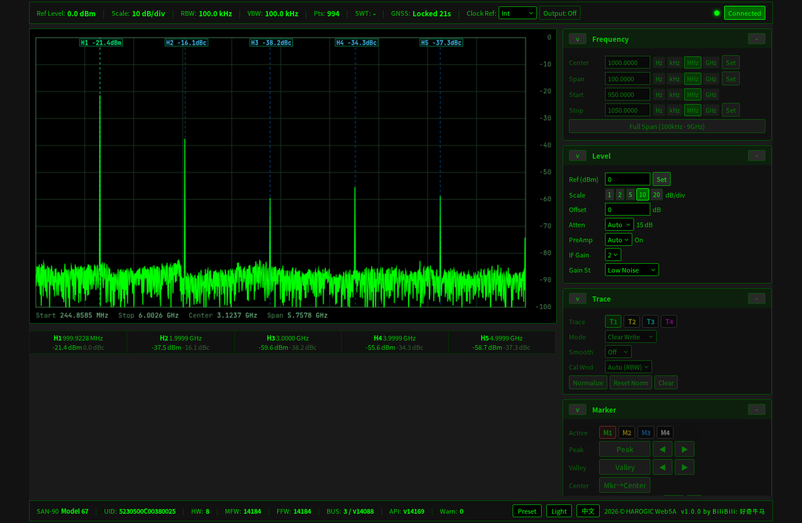
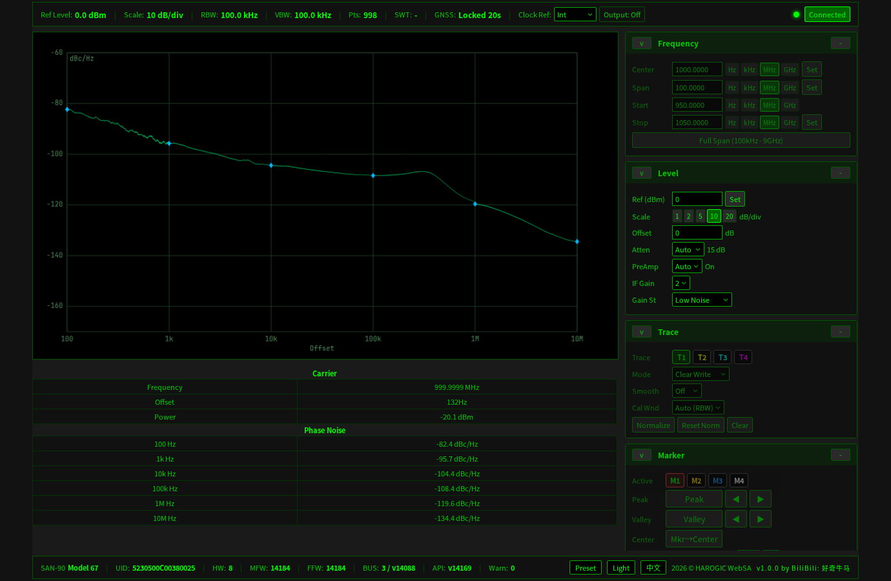
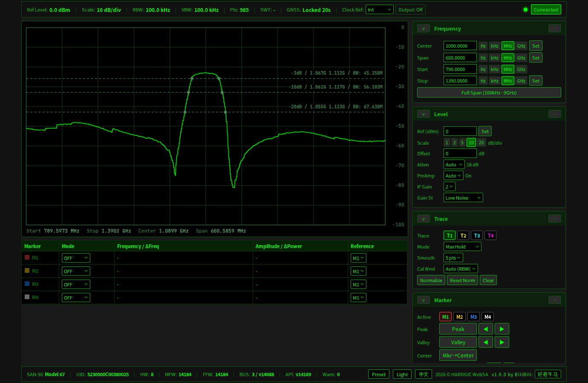
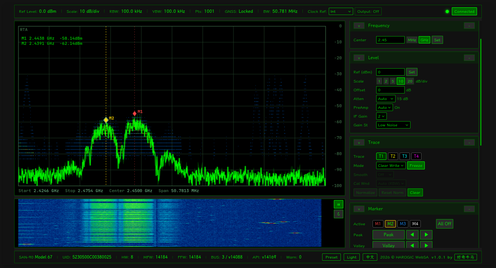

# Harogic SAN 系列频谱仪 Web 上位机 (SAN-45 / SAN-60 / SAN-90)

**English: [README.md](README.md)**

基于 **Harogic SAN 系列频谱仪**（SAN-45 / SAN-60 / SAN-90，海得逻捷）官方 SDK（`htra_api.py` + `libhtraapi.so`，USB 连接）的浏览器 Web 上位机。



## 设备实拍

| SAN-90 | SAN-90 + WebSA 实拍 |
|---|---|
|  |  |

## 特性

- **频谱显示** — 清除写入 / 最大保持 / 最小保持 / 平均 / 查看冻结，4 条迹线，前端平滑
- **控制面板** — Center/Span 与 Start/Stop 原子联动、可自定义/自动联动的 Span Step 与 `▼/Full/▲` 控制、SWP/RTA 模式私有参数、RBW/VBW/点数、FFT 窗口（FlatTop / B-Nuttall / LowSideLobe / Rectangle / Kaiser，与官方一致）、衰减/前置放大/中频增益、Manual/Auto Ref Level、参考时钟（内部/外部/外部强制 + 输出）
- **Marker 与 DSP 引擎** — 4 个游标、表格行快速 On/Off、独立 Tracking toggle、多个游标按峰值排序分配并连续追踪、寻峰寻谷遍历

  - Savitzky-Golay 平滑（2 阶 + 梯度自适应）
  - 三级寻峰引擎：局部极值 → Escursion 双侧 ≥6dB → 抛物线亚频点拟合
  - 谷凹陷合并（25bin，与 Valley 定位一致）、频率方向遍历
  - Raw Anchor（未平滑时取原始迹线真实极值）
- **实时频谱 (RTA)** — FPGA 引擎、多迹线(各 tab 独立模式)、概率密度背景(渐隐痕迹)、瀑布图
- **GNSS 详情浮层** — 点击指示器查看完整信息(锁定/卫星/天线/经纬度/UTC 时间); 状态每秒自动刷新
- **测量模式** — 幅度（n-dB 带宽）、谐波（H1~H5 服务器自动调谐）、相噪（6 档频偏 100Hz~10MHz）
- **归一化** — 直通校准、自适应吸收、显示层变换

## 界面截图

| 深色主题 | 中文界面 | 浅色主题 |
|---|---|---|
|  |  |  |

| 多点寻峰 (MAX_HOLD + 平滑) | 谐波测量 | 相噪测量 |
|---|---|---|
|  |  |  |
| 寻谷 (DUT 扫频, MAX_HOLD + smooth=5) | 幅度测量 (N dB) | — |
|  |  | |
| 瀑布 + RTA 实时频谱 |
|  |

## 快速开始

### 前置条件

- Python ≥ 3.10（aiohttp、NumPy；硬件冒烟工具可选 pyserial）
- Node.js ≥ 18（仅重建前端时需要）
- Harogic SAN 系列频谱仪 + 官方 SDK：
  - `htra_api.py` — 已包含在仓库根目录（官方 Python 包装，HAROGIC 版权）
  - `libhtraapi.so` — **专有二进制，请从 HAROGIC 官方获取**；放入 `ctypes` 可搜索路径

### 1. 安装依赖

```bash
pip install -r requirements.txt          # aiohttp, NumPy, pytest, pyserial
./build.sh                               # 安装/同步前端依赖并执行 Vite 构建
```

### 2. 运行

```bash
./run.sh
```

浏览器打开 http://127.0.0.1:8080

默认仅监听本机。远程访问必须设置令牌：

```bash
WEBSA_HOST=0.0.0.0 WEBSA_TOKEN='请替换为长随机令牌' ./run.sh
```

然后访问 `http://设备地址:8080/?token=同一令牌`。完整环境变量、远程部署、日志和硬件测试见
[`docs/zh-CN/FAQ_NOTES.md`](docs/zh-CN/FAQ_NOTES.md)；SWP/RTA 参数语义见
[`docs/zh-CN/MODE_STATE_FLOW.md`](docs/zh-CN/MODE_STATE_FLOW.md)。

### 3. 测试

```bash
./test.sh
python3 -m ruff check web_sa tests tools
cd frontend/modern && npm audit
```

## 目录结构

```
harogic-websa/
├─ web_sa/               后端 (supervisor + aiohttp worker, 设备调用串行)
│  ├─ hardware/          sdk_bindings.py(唯一 dll 接触点) / device.py
│  ├─ measurements/      Std/Harmonic/PhaseNoise 会话 + framer(帧协议)
│  └─ web/               ws.py / http_api.py / publisher.py
├─ frontend/
│  └─ modern/            TS 前端 (Vite + TypeScript, i18n + 主题)
│     └─ src/__tests__/  vitest 测试(DSP 引擎, 合成迹线)
├─ htra_api.py           官方 SDK Python 包装 (HAROGIC 版权)
├─ docs/                 文档 (en/ + zh-CN/): 架构 / API / 模式流转 / 已知问题 / FAQ / 重构留痕
├─ tests/                后端 pytest(协议/配置/设备状态/HTTP API)
├─ screenshots/          README 截图
├─ run.sh / stop.sh / clean.sh / build.sh / test.sh / Makefile
├─ pyproject.toml / requirements.txt / LICENSE / .gitignore
```

## 脚本

| 脚本 | 说明 |
|---|---|
| `./run.sh` | 启动 supervisor + WebSA worker；SDK 崩溃/致命超时自动退避重启 |
| `./stop.sh` | 停止服务 |
| `./clean.sh` | 清理缓存/日志/构建产物 |
| `./test.sh` | 后端 pytest + Ruff + 前端 Vitest；任一失败返回非零状态 |
| `make run/stop/clean/build/test` | 同 Makefile 入口 |

## 测试

- **后端（51 项）**：帧协议、配置/安全默认、命令校验、SWP/RTA 状态隔离、Auto Ref、RTA Ref Clock/连续失败恢复、状态 JSON 清洗、HTTP/WS 鉴权与路径防护、有界客户端推送、采集 watchdog、supervisor/TinySA 安全规则——**常规测试无需硬件**
- **前端（23 项）**：DSP 引擎合成迹线、频率单位确认、Span Step、SWP/RTA Marker Tracking、S-G 平滑、寻峰寻谷、保峰重采样、归一化和实时分位数统计——**无需硬件**

## 开源说明

- 项目代码（后端 + 前端）：**MIT** 协议
- `htra_api.py`：HAROGIC 官方 SDK Python 包装，版权归 HAROGIC（海得逻捷）；随项目附带供配合自有 SDK 使用
- `libhtraapi.so`：专有二进制，**不在本仓库**，需从 HAROGIC 官方获取
- 截图使用真实 SAN-90 + TinySA 扫频源拍摄


---

## 作者

[好奇牛马 (B站)](https://space.bilibili.com/28447213)
