# Harogic SAN 系列频谱仪 Web 上位机 (SAN-45 / SAN-60 / SAN-90)

**English: [README.md](README.md)**

基于 **Harogic SAN 系列频谱仪**（SAN-45 / SAN-60 / SAN-90，海得逻捷）官方 SDK（`htra_api.py` + `libhtraapi.so`，USB 连接）的浏览器 Web 上位机。

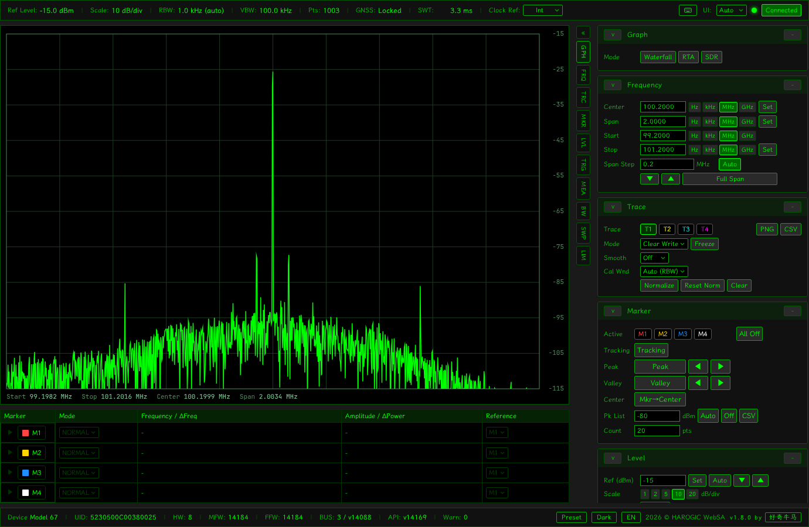

## 设备实拍

| SAN-90 | SAN-90 + WebSA 实拍 |
|---|---|
| 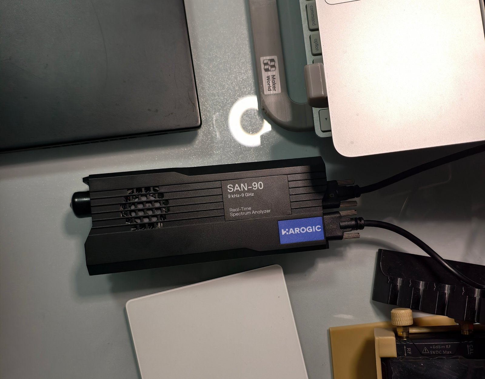 | 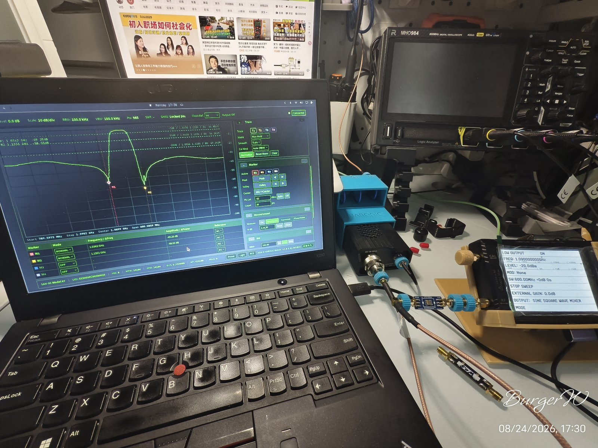 |

## 特性

- **频谱显示** — 清除写入 / 最大保持 / 最小保持 / 平均 / 查看冻结，4 条迹线，平滑与保峰重采样
- **显示放大** — 仅放大显示已采集频谱，不重配仪器；概览窗显示全局范围，瀑布图跟随同一视窗
- **控制面板** — Center/Span 与 Start/Stop 原子联动、Span Step 与 Full Span、RBW/VBW/点数、
  FFT 窗口、衰减/前置放大/中频增益、手动或一次性 Auto Ref Level、参考时钟与输出
- **Marker** — 4 个游标、独立跟踪、按峰值排序分配、寻峰寻谷、Savitzky-Golay 平滑
- **实时频谱 (RTA)** — FPGA 引擎、多迹线、概率密度背景、瀑布图
- **测量模式** — 幅度（n-dB 带宽）、谐波（H1~H5）、相噪
- **信道测量** — 信道功率、占用带宽（90/95/99%）、邻道功率比（ACPR）
- **SDR 接收** — IQ 流式传输 + DSP 在浏览器中运行：AM/DSB/USB/LSB/CW/NFM/WFM/PM 解调、
  降噪（Wiener，可选 DeepFilterNet3）、音频链、频谱与瀑布
- **数字模式** — FT8 解码（多轮次消去 + OSD 回退）、CW 解码与 DRM30（短波广播）解码
- **触发与辅助** — RTA 设备电平触发 + 扫描模式软件触发；限制线与通过/失败余量；归一化；PNG/CSV 导出
- **界面** — 侧边跳转窄条、可选虚拟键盘、幅度单位与外部增益/线损补偿、深/浅主题、中英文
- **设备链路监控** — 拔线在画布上明确提示（而非定格假死），重新接入后自动恢复原模式，无需重启服务

## 界面截图

| 深色主题 | 中文界面 | 浅色主题 |
|---|---|---|
|  | 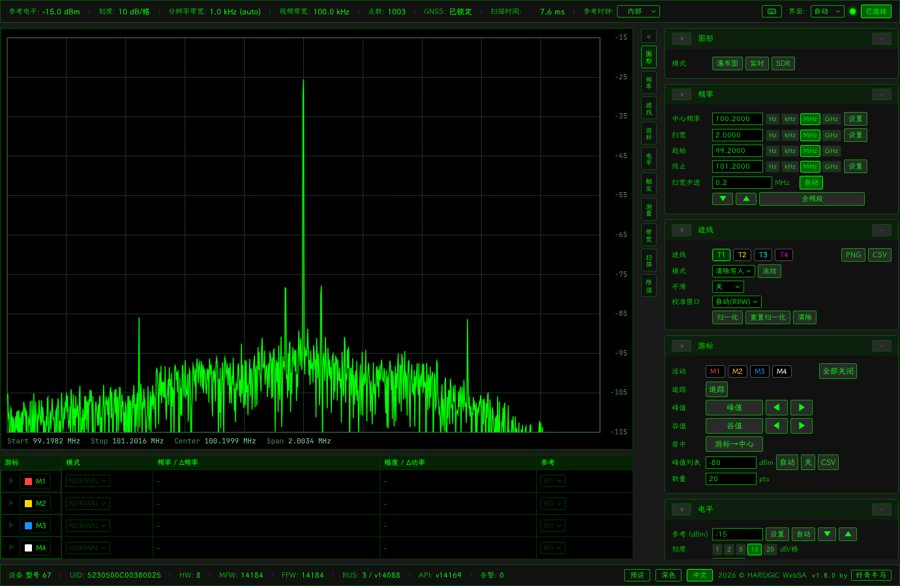 | 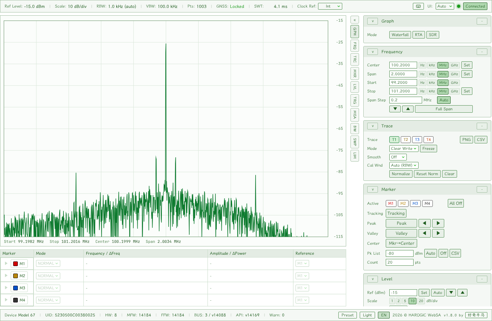 |

| 多点寻峰 | 谐波测量 | 相噪测量 |
|---|---|---|
| 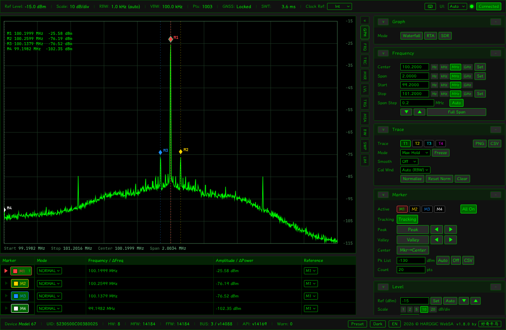 | 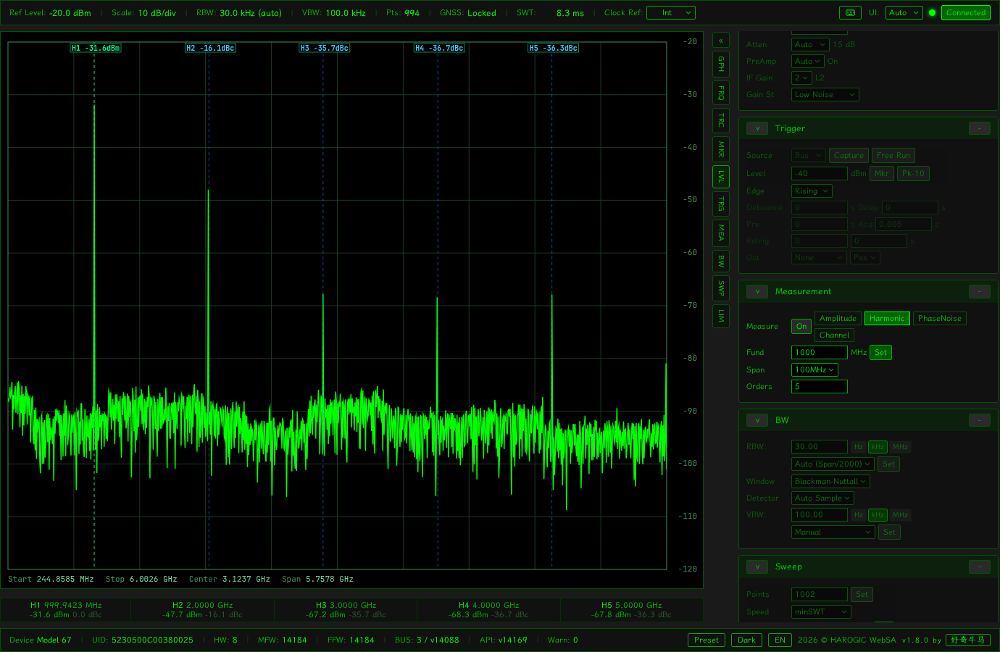 | 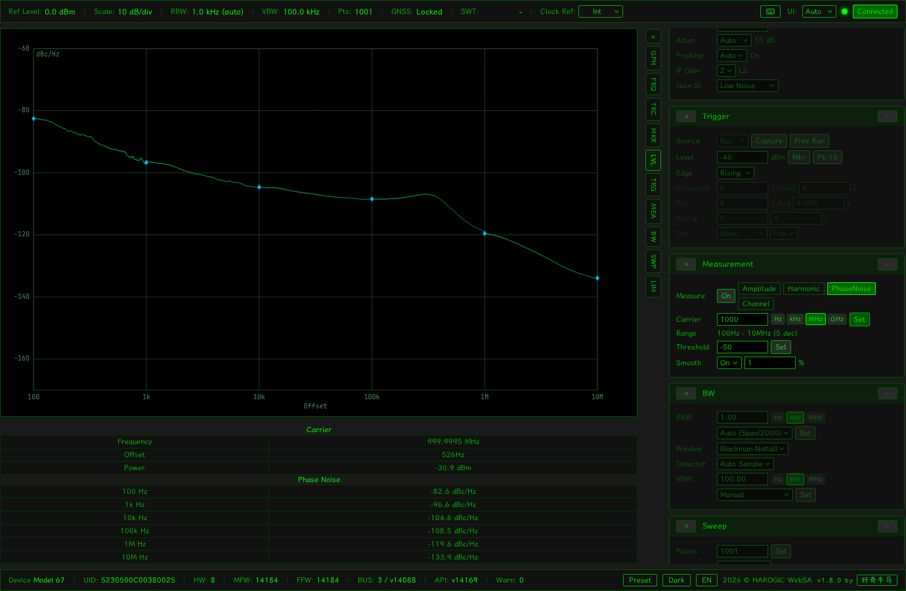 |
| 幅度测量 | RTA + 瀑布 | |
| 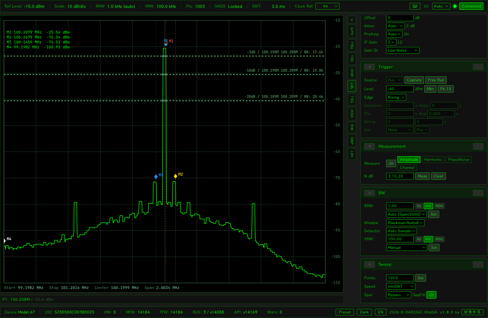 | 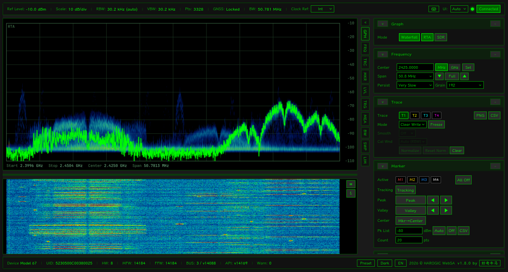 | |
| FT8 解码 (SDR) | CW 解码 (SDR) | |
| 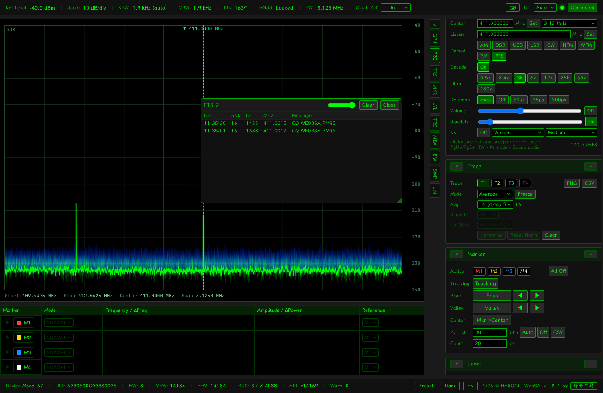 | 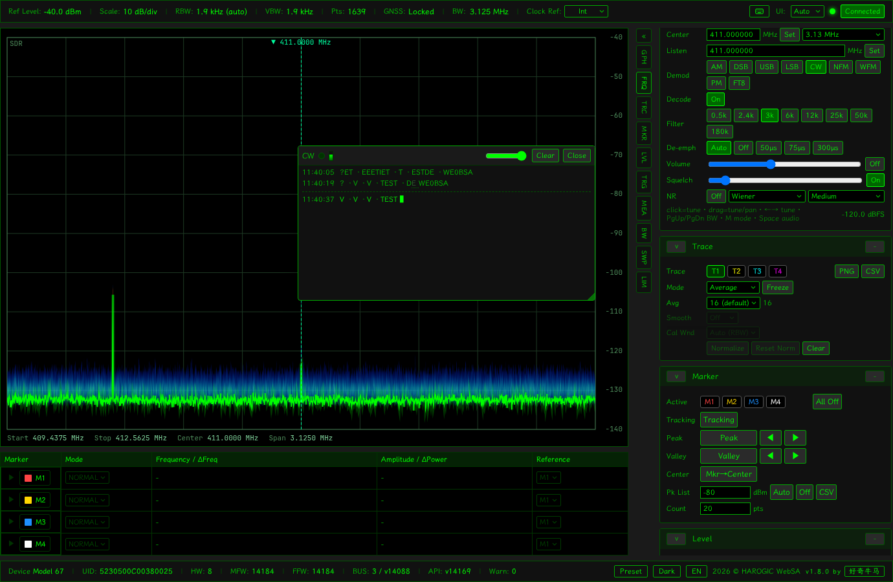 | |

## 快速开始

### 前置条件

- Python ≥ 3.10（aiohttp、NumPy；硬件冒烟工具可选 pyserial）
- Node.js ≥ 18（仅重建前端时需要）
- Harogic SAN 系列频谱仪 + 官方 SDK：
  - `htra_api.py` — 已包含在仓库根目录（官方 Python 包装，HAROGIC 版权）
  - `libhtraapi.so` — **专有二进制，请从 HAROGIC 官方获取**；放入 `ctypes` 可搜索路径

### 1. 安装依赖

```bash
pip install -r requirements.txt          # aiohttp, NumPy, pytest, pyserial
./build.sh                               # 安装/同步前端依赖并执行 Vite 构建
```

### 2. 运行

```bash
./run.sh
```

浏览器打开 http://127.0.0.1:8080

拔掉频谱仪会被检测并上报，重新接入后自动恢复原模式，无需重启；`make status` 查看实时链路，
`make restart` 重启服务。

默认仅监听本机。远程访问必须设置令牌：

```bash
WEBSA_HOST=0.0.0.0 WEBSA_TOKEN='请替换为长随机令牌' ./run.sh
```

然后访问 `http://设备地址:8080/?token=同一令牌`。完整环境变量、远程部署、日志和硬件测试见
[`docs/zh-CN/FAQ_NOTES.md`](docs/zh-CN/FAQ_NOTES.md)；SWP/RTA 参数语义见
[`docs/zh-CN/MODE_STATE_FLOW.md`](docs/zh-CN/MODE_STATE_FLOW.md)。
独立的架构与代码评估（含分阶段重构建议）见
[`docs/zh-CN/ARCH_REVIEW.md`](docs/zh-CN/ARCH_REVIEW.md)；开发指南（分层归属、状态归属、
新增功能清单、测试与性能规则、守卫清单、排障手册与教训台账）见
[`docs/zh-CN/DEVELOPMENT.md`](docs/zh-CN/DEVELOPMENT.md)。

### 3. 测试

```bash
pip install -r requirements-dev.txt      # 运行时 + pytest/ruff/playwright/fonttools
make ci                                  # CI 的全部门禁（无需硬件）
python3 tools/bench/bench.py --check tools/bench/bench_baseline.json   # 性能基线（需服务在跑）
make hw-test                             # 需真机：tinySA CW + 界面状态机回归
```

## 目录结构

```
harogic-websa/
├─ web_sa/               后端 (supervisor + aiohttp worker, 设备调用串行)
│  ├─ hardware/          sdk_bindings.py(唯一 dll 接触点) / device.py
│  ├─ measurements/      Std/Harmonic/PhaseNoise 会话 + framer(帧协议)
│  └─ web/               ws.py / http_api.py / publisher.py
├─ frontend/             TS 前端 (Vite + TypeScript, i18n + 主题)
│  └─ src/__tests__/     vitest 测试(DSP 引擎, 合成迹线)
├─ htra_api.py           官方 SDK Python 包装 (HAROGIC 版权)
├─ docs/                 文档 (en/ + zh-CN/): 架构 / API / 模式流转 / 已知问题 / FAQ / 重构留痕 /
│                        架构评估 / 开发指南
├─ tests/                后端 pytest(协议/配置/设备状态/HTTP API)
├─ screenshots/          README 截图
├─ run.sh / stop.sh / status.sh / clean.sh / build.sh / test.sh / Makefile
├─ pyproject.toml / requirements.txt / LICENSE / .gitignore
```

## 脚本

日常命令，以及提交前应该跑的东西：

| 脚本 | 说明 |
|---|---|
| `./run.sh` / `./stop.sh` | 启动 / 停止服务（supervisor + worker）|
| `make restart` / `make status` | 重启 / 查看运行状态、PID、内存、CPU、日志、设备链路 |
| `make build` | 完整构建：WASM 内核（仅在 stale 且有 Rust 时）+ 前端 |
| `make frontend` | 仅前端：npm install + Vite 构建（不碰 WASM）|
| `make wasm` | 两个 WASM 内核；`make wasm-dsp` / `make wasm-dfn` 单独构建其中一个 |
| `make clean` / `make clean-all` | 清缓存/日志/dist（保留依赖与 WASM 缓存）/ 全清（含 node_modules 与 WASM target）|
| `./test.sh` | 后端 pytest + Ruff + 前端 Vitest |
| `make ci` | CI 的全部进程内门禁（无需硬件）|
| `make e2e-fake` | 假后端上的浏览器端到端测试（无需硬件）|
| `make hw-test` | **需真机**：tinySA CW 冒烟 + 界面状态机回归 |
| `make bench` | 与已记录的性能基线比较 |

完整清单（fixture 重生成、各类守卫、文档/版本检查、台位探针）见
[`docs/zh-CN/DEVELOPMENT.md`](docs/zh-CN/DEVELOPMENT.md) §13。

## 测试

- **后端**（pytest）与**前端**（Vitest）覆盖协议、配置、命令校验、Marker/DSP 逻辑、参数槽位与
  i18n 一致性；golden fixture 锁定二进制帧协议与 DSP 内核（与 Rust/WASM 实现互通）。
- **默认无需硬件**：缺少 `libhtraapi.so` 时自动跳过依赖厂商库的测试，因此 `make ci` 在任何机器
  上都能跑完其余门禁；`make e2e-fake` 追加假后端上的浏览器端到端测试；`make hw-test` 需要频谱仪
  （CW 信号需 tinySA）。

## 开源说明

- 项目代码（后端 + 前端）：**MIT** 协议
- `htra_api.py`：HAROGIC 官方 SDK Python 包装，版权归 HAROGIC（海得逻捷）；随项目附带供配合自有 SDK 使用
- `libhtraapi.so`：专有二进制，**不在本仓库**，需从 HAROGIC 官方获取
- 截图使用真实 SAN-90 拍摄（SDR 数字模式截图使用 PlutoSDR 作为信号源）


---

## 作者

[好奇牛马 (B站)](https://space.bilibili.com/28447213)
